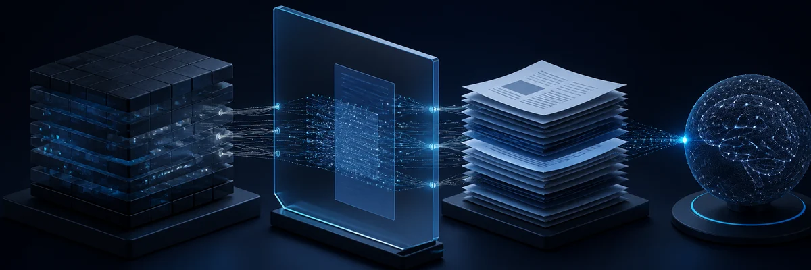
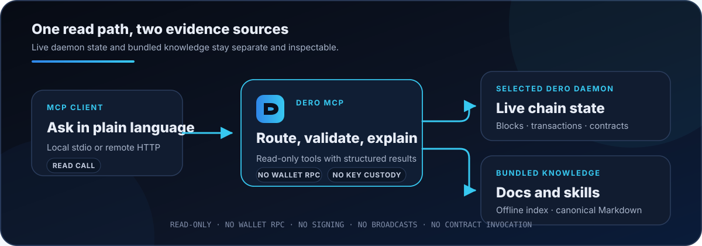

# DERO MCP Server



[](https://www.npmjs.com/package/dero-mcp-server)
[](https://github.com/DHEBP/dero-mcp-server/actions/workflows/ci.yml)
[](https://registry.modelcontextprotocol.io/v0.1/servers?search=io.github.DHEBP/dero-mcp-server)
[](LICENSE)

A read-only [Model Context Protocol](https://modelcontextprotocol.io) server for querying DERO chain state, analyzing smart contracts and transactions, searching bundled documentation, and following focused product runbooks.

**Source:** [DHEBP/dero-mcp-server](https://github.com/DHEBP/dero-mcp-server) · **Version:** `0.7.0`

[Quickstart](#quickstart) · [Capabilities](#what-it-does) · [Skills](#skills-over-mcp) · [Safety](#safety-and-privacy) · [HTTP](#self-hosted-http) · [Development](#development)

## Release status

Version `0.7.0` defines the same read-only surface for the npm package and the official MCP Registry entry.

| Surface | Count |
|---|---:|
| **Tools** | 34 |
| **Resources** | 8 |
| **Prompts** | 5 |
| **Skills** | 4 |

The v0.7 tool total is 17 daemon RPC reads + 1 local proof decoder + 3 documentation tools + 12 composites + the `read_dero_skill` compatibility tool. Its eight resources are four server resources and four canonical `skill://<name>/SKILL.md` files.

## Quickstart

You need Node.js 20+ and an MCP client that can launch a local subprocess. A local DERO daemon is optional but recommended for privacy and reliability.

### Install from npm

Add this subprocess descriptor to your client's MCP configuration:

```json
{
  "mcpServers": {
    "dero": {
      "command": "npx",
      "args": ["-y", "dero-mcp-server@0.7.0"]
    }
  }
}
```

When `DERO_DAEMON_URL` is omitted, the server first probes `127.0.0.1:10102` and otherwise uses the disclosed TLS fallback at `https://dero.rabidmining.com`. To choose a daemon explicitly, add:

```json
"env": { "DERO_DAEMON_URL": "https://dero.rabidmining.com" }
```

Restart the client, then ask:

> What's the current DERO chain height?

See [Safety and privacy](#safety-and-privacy) before sending queries to any third-party daemon.

### Build from source

```bash
git clone https://github.com/DHEBP/dero-mcp-server.git
cd dero-mcp-server
npm ci
npm run build
```

Point the same MCP configuration at the built entry point:

```json
{
  "mcpServers": {
    "dero": {
      "command": "node",
      "args": ["/absolute/path/to/dero-mcp-server/dist/index.js"]
    }
  }
}
```

Clients that cannot launch a subprocess need a self-hosted streamable-HTTP endpoint instead.

## What it does

| Area | Available reads and analyses |
|---|---|
| Chain state | Health, height, blocks, mempool, transactions, encrypted balances, and names |
| Smart contracts | Source and state inspection, pattern summaries, deploy-gas estimates, and documentation context |
| Transactions | Inclusion and kind classification, contract-install context, and proof decoding |
| TELA | dURL discovery, app manifests, file lists, and on-chain HTML/CSS/JavaScript content |
| Documentation | Search and retrieval across the bundled derod, TELA, Hologram, and DeroPay corpus |
| Composite analysis | Chain diagnosis, claim audits, supply verification, reading paths, and deploy preflight |

Version 0.7 ships a 154-page offline documentation index. Chain tools still query the selected daemon; documentation and skill reads do not need a network request.

Try prompts such as:

- “Is this daemon healthy and synced?”
- “Explain the contract at SCID `<scid>` and cite the relevant DVM documentation.”
- “Trace transaction `<hash>` with confirmation and contract context.”
- “Find a reading path for deploying a DVM-BASIC contract.”
- “List a few TELA apps, then inspect one manifest and its files.”
- “Load the DeroPay skill and guide me through a merchant integration.”



## Skills over MCP

Version 0.7 packages four concise workflow guides:

| Skill | Use it for |
|---|---|
| `dero` | Chain health, transactions, DVM contracts, proofs, and supply verification |
| `tela` | dURL discovery, app inspection, on-chain files, and TELA development guidance |
| `hologram` | Hologram browser, wallet, Studio, simulator, and troubleshooting guidance |
| `deropay` | DeroPay, DeroAuth, checkout, router, escrow, and merchant integrations |

Clients implementing the draft [Skills-over-MCP proposal (SEP-2640)](https://github.com/modelcontextprotocol/modelcontextprotocol/pull/2640) can use `skills/list`, `skills/get`, and the corresponding `skill://<name>/SKILL.md` resource. Other clients can call the read-only `read_dero_skill` tool. Both paths return the same packaged Markdown bytes.

[`SKILL.md`](SKILL.md) is a compatibility index for hosts that expect one root file. The canonical files live under [`skills/`](skills/). Reconnect or rescan a client that caches its tool or skill catalog after upgrading.

## Safety and privacy

- **Read-only boundary:** the server does not expose wallet RPC, transfers, smart-contract invocation, raw transaction submission, block submission, wallet keys, or seed storage.
- **Read-only is not anonymous:** the selected daemon can observe the connection and RPC requests it receives. Prefer a daemon you operate.
- **Local-first fallback:** without `DERO_DAEMON_URL`, the server checks the default local daemon before using the disclosed third-party TLS endpoint at `https://dero.rabidmining.com`. The fallback is convenience, not a privacy guarantee, and its pruned history cannot satisfy every archival query.
- **Offline knowledge:** bundled documentation and skills are read from the installed package rather than a hosted search service.
- **Daemon URL handling in v0.7:** HTTP(S) query parameters are preserved for calls, URL userinfo is rejected, a trailing `/json_rpc` is normalized rather than duplicated, and query values are removed from logs and diagnostic disclosures.
- **Structured failures:** tools return machine-readable error codes, hints, and retry guidance rather than requiring clients to parse arbitrary exception text.

DERO protects on-chain values and identities according to its protocol; it does not make a third-party RPC connection invisible. Learn about DERO itself at [derod.org](https://derod.org).

## Self-hosted HTTP

For clients that need a URL, run the server behind TLS:

```bash
export DERO_MCP_AUTH_TOKEN="$(openssl rand -base64 48)"
npx -y dero-mcp-server@0.7.0 --http
```

The MCP endpoint is `/mcp`; health information is available at `/health`. The default listener is loopback-only.

| Variable | Default | Purpose |
|---|---|---|
| `DERO_DAEMON_URL` | local-first | Pin an HTTP(S) daemon base URL; no `/json_rpc` suffix is required |
| `DERO_ARCHIVE_DAEMON_URL` | unset | Live-test-only archive daemon for historical transaction cases; never selected by the server at runtime |
| `DERO_DOCS_ROOT` | bundled index | Development-only local documentation source override |
| `DERO_MCP_HTTP` | unset | Set to `1` instead of passing `--http` |
| `DERO_MCP_HTTP_HOST` | `127.0.0.1` | Listen address |
| `DERO_MCP_HTTP_PORT` | `8787` | Listen port |
| `DERO_MCP_ALLOWED_HOSTS` | unset | Required for non-loopback binds; comma-separated lowercase hostnames without schemes or ports |
| `DERO_MCP_ALLOWED_ORIGINS` | empty | Optional lowercase Origin-hostname allowlist; empty rejects requests that present `Origin` |
| `DERO_MCP_AUTH_TOKEN` | unset | Bearer token required on `/mcp` when configured |

Host and Origin checks reduce DNS-rebinding and browser cross-origin risk; they do not replace bearer authentication or TLS. The [`deploy/`](https://github.com/DHEBP/dero-mcp-server/tree/main/deploy) reference provides Docker Compose, Caddy, and automatic TLS for a production-style deployment.

## Development

After completing the [source build](#build-from-source):

```bash
# Daemon-independent verification gate
npm test

# Network-dependent daemon and composite flows
npm run verify:live

# Optional: include archive-only historical cases in the live suite
DERO_ARCHIVE_DAEMON_URL=https://your-archive-daemon.example npm run verify:live

# Isolated pack/install/run check
npm run smoke:package
```

The daemon-independent gate covers types, builds, protocol surfaces, documentation, skills, HTTP behavior, package installation, and the production dependency audit. Some package and audit steps can still access npm. Live checks use the configured daemon or the disclosed public fallback. Historical cases run when the primary daemon retains the fixture; otherwise they skip unless `DERO_ARCHIVE_DAEMON_URL` supplies archive coverage. The HTTP example above exposes requests to that node operator, so use an archive daemon you trust when possible.

## Documentation

- [`skills/`](skills/) — canonical DERO, TELA, Hologram, and DeroPay runbooks
- [`POSITIONING.md`](POSITIONING.md) — audience, alternatives, and product boundaries
- [`deploy/README.md`](https://github.com/DHEBP/dero-mcp-server/blob/main/deploy/README.md) — remote deployment and security posture
- [`docs/DOCS-BUNDLE-SYNC.md`](https://github.com/DHEBP/dero-mcp-server/blob/main/docs/DOCS-BUNDLE-SYNC.md) — bundled documentation provenance and refresh process
- [`CHANGELOG.md`](https://github.com/DHEBP/dero-mcp-server/blob/main/CHANGELOG.md) — release-by-release behavior
- [`server.json`](https://github.com/DHEBP/dero-mcp-server/blob/main/server.json) — MCP Registry descriptor
- [GitHub issues](https://github.com/DHEBP/dero-mcp-server/issues) — bugs and feature requests

## License

[MIT](LICENSE)
